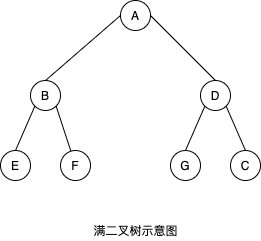
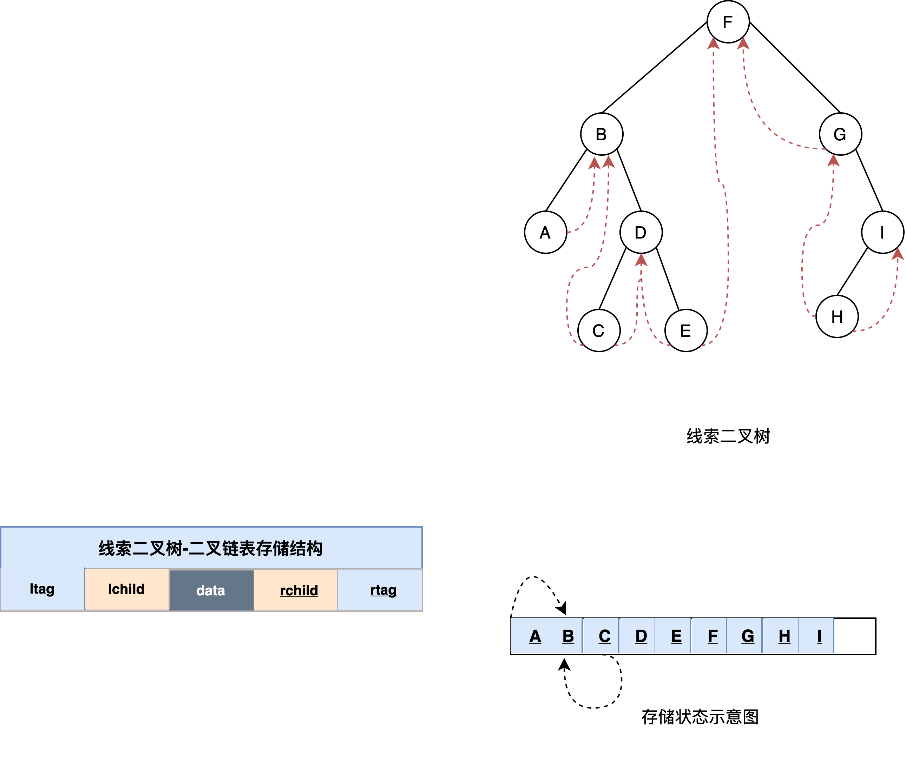

# 4.1.4.1 线索二叉树

通过前面对二叉树的学习，了解到二叉树本身是一种非线性结构，采用任何一种遍历二叉树的方法，都可以得到树中所有结点的一个线性序列。在这个序列中，除第一个结点外，每个结点都有自己的直接前趋；除最后一个结点外，每个结点都有一个直接后继。



例如，图 1 采用先序遍历的方法得到的结点序列为：` 1 2 4 5 3 6 7 `，在这个序列中，结点 2 的直接前趋结点为 1，直接后继结点为 4。


## 线索二叉树的定义


二叉树的遍历实质上是<font color=#008000>对一个非线性结构进行线性化的过程</font> ，它使得每个结点（除第一个和最后一个)在这些线性序列中<font color=#008000>有且只有一个直接前驱和直接后继。</font>

但是在二叉链表存储结构中，只能找到一个结点的左、右孩子，不能直接得到结点在任一遍历序列中的前驱和后继，这些信息只有在遍历的动态过程中才能得到，因此引入线索二叉树来保存这些动态过程中得到的信息。


## 建立线索二叉树

为了保存结点在任一序列中的前驱和后继信息，可以考虑在每个结点中增加两个指针域来存放遍历时得到的前驱和后继信息，这样就可以为以后的访问带来方便。但增加指针信息会降低存储空间的利用率，因此可以考虑采用其他方法


若 n 个结点的二叉树采用二叉链表做存储结构，则链表中必然有 n+1 个空指针域，可以利用这些空指针域来存放前驱和后继信息，为此需要在结点中增加标示 `ltag` 和 `rtag` 以区分孩子指针的指向，如下所示


其中:

$$
ltag =
\begin{cases}
1   lchild  is the domain indicates the left child of a node \\
0   lchild is the domain indicates a direct precursor to a node
\end{cases}


$$

rtag =
\begin{cases}
1   rchild 域指示结点的右孩子 \\
0   rchild 域指示结点的直接后继
\end{cases}

结点结构代码实现：

```c
#define TElemType int//宏定义，结点中数据域的类型
//枚举，Link为0，Thread为1
typedef enum PointerTag{
    Link,
    Thread
}PointerTag;
//结点结构构造
typedef struct BiThrNode{
    TElemType data;//数据域
    struct BiThrNode* lchild,*rchild;//左孩子，右孩子指针域
   
    PointerTag Ltag,Rtag;//标志域，枚举类型
}BiThrNode,*BiThrTree;
```

表示二叉树时，使用图 2 所示的结点结构构成的二叉链表，被称为<font color=#008000>线索链表</font> ；构建的二叉树称为<font color=#008000>线索二叉树</font> 。


<table><tr><td bgcolor=PowderBlue>
线索链表中的“线索”，指的是链表中指向结点前趋和后继的指针。二叉树经过某种遍历方法转化为线索二叉树的过程称为线索化。
</td></tr></table>

### 对二叉树进行线索化

将二叉树转化为线索二叉树，实质上是在遍历二叉树的过程中，将二叉链表中的空指针改为指向直接前趋或者直接后继的线索。

<font color=red> 线索化的过程即为在遍历的过程中修改空指针的过程。</font>

在遍历过程中，如果当前结点没有左孩子，需要将该结点的 lchild 指针指向遍历过程中的前一个结点，所以在遍历过程中，设置一个指针（名为 pre ），时刻指向当前访问结点的前一个结点。


代码实现（拿中序遍历为例）：

```c
//中序对二叉树进行线索化
void InThreading(BiThrTree p){
    //如果当前结点存在
    if (p) {
        InThreading(p->lchild);//递归当前结点的左子树，进行线索化
        //如果当前结点没有左孩子，左标志位设为1，左指针域指向上一结点 pre
        if (!p->lchild) {
            p->Ltag=Thread;
            p->lchild=pre;
        }
        //如果 pre 没有右孩子，右标志位设为 1，右指针域指向当前结点。
        if (!pre->rchild) {
            pre->Rtag=Thread;
            pre->rchild=p;
        }
        pre=p;//线索化完左子树后，让pre指针指向当前结点
        InThreading(p->rchild);//递归右子树进行线索化
    }
}
```

注意：

<table><tr><td bgcolor=PowderBlue>
中序对二叉树进行线索化的过程中，在两个递归函数中间的运行程序，和之前介绍的中序遍历二叉树的输出函数的作用是相同的。
</td></tr></table>

将中间函数移动到两个递归函数之前，就变成了前序对二叉树进行线索化的过程；后序线索化同样如此


## 访问线索二叉树


如何在线索二叉树中查找结点的前驱和后继呢？


以中序线索二叉树为例，令 p指向树中的某个结点，查找p所指结点的后继结点的方法如下所述

1. 若 p -> rtag == 1 ,则 p->child 即指向其后继结点
1. 若 p -> rtag == 0 ,则 p 所指结点的中序后继必然是其右子树中进行 `中序遍历` 得到的第一结点，也就是说，从p所指结点的右子树的根结点出发，沿左孩子指针链向下查找，直到找到一个没有左孩子的结点为止，这个结点就是p所指结点的直接后继结点，也称为p的右子树中"最左下"的结点





图中是一个按照中序遍历建立的线索二叉树。其中，实线表示指针，指向的是左孩子或者右孩子。虚线表示线索，指向的是该结点的直接前趋或者直接后继。

 
使用线索二叉树时，会经常遇到一个问题，如图 3 中，结点 b 的直接后继直接通过指针域获得，为结点 * ；而由于结点 * 的度为 2 ，无法利用指针域指向后继结点，整个链表断掉了。

当在遍历过程，遇到这种问题是解决的办法就是：<font color=red>寻找先序、中序、后序遍历的规律，找到下一个结点。</font>

在先序遍历过程中，如果结点因为有右孩子导致无法找到其后继结点，如果结点有左孩子，则后继结点是其左孩子；否则，就一定是右孩子。拿图 3 举例，结点 + 的后继结点是其左孩子结点 a ，如果结点 a 不存在的话，就是结点 * 。

在中序遍历过程中，结点的后继是遍历其右子树时访问的第一个结点，也就是右子树中位于最左下的结点。例如图 3 中结点 * ，后继结点为结点 c ，是其右子树中位于最左边的结点。反之，结点的前趋是左子树最后访问的那个结点。

后序遍历中找后继结点需要分为 3 种情况：

1. 如果该结点是二叉树的根，后继结点为空；
1. 如果该结点是父结点的右孩子（或者是左孩子，但是父结点没有右孩子），后继结点是父结点；
1. 如果该结点是父结点的左孩子，且父结点有右子树，后继结点为父结点的右子树在后序遍历列出的第一个结点。


> 使用后序遍历建立的线索二叉树，在真正使用过程中遇到链表的断点时，需要访问父结点，所以在初步建立二叉树时，宜采用三叉链表做存储结构


遍历线索二叉树非递归代码实现：


```c
//中序遍历线索二叉树
void InOrderThraverse_Thr(BiThrTree p)
{
    while(p)
    {
        //一直找左孩子，最后一个为中序序列中排第一的
        while(p->Ltag == Link){
            p = p->lchild;
        }
        printf("%c ", p->data);  //操作结点数据
        //当结点右标志位为1时，直接找到其后继结点
        while(p->Rtag == Thread && p->rchild !=NULL){
            p = p->rchild;
            printf("%c ", p->data);
        }
        //否则，按照中序遍历的规律，找其右子树中最左下的结点，也就是继续循环遍历
        p = p->rchild;
    }
}

```


整节完整代码

```c
#include <stdio.h>
#include <stdlib.h>
#define TElemType char//宏定义，结点中数据域的类型
//枚举，Link为0，Thread为1
typedef enum {
    Link,
    Thread
}PointerTag;
//结点结构构造
typedef struct BiThrNode{
    TElemType data;//数据域
    struct BiThrNode* lchild,*rchild;//左孩子，右孩子指针域
    PointerTag Ltag,Rtag;//标志域，枚举类型
}BiThrNode,*BiThrTree;
BiThrTree pre=NULL;
//采用前序初始化二叉树
//中序和后序只需改变赋值语句的位置即可
void CreateTree(BiThrTree * tree){
    char data;
    scanf("%c",&data);
    if (data!='#'){
        if (!((*tree)=(BiThrNode*)malloc(sizeof(BiThrNode)))){
            printf("申请结点空间失败");
            return;
        }else{
            (*tree)->data=data;//采用前序遍历方式初始化二叉树
            CreateTree(&((*tree)->lchild));//初始化左子树
            CreateTree(&((*tree)->rchild));//初始化右子树
        }
    }else{
        *tree=NULL;
    }
}
//中序对二叉树进行线索化
void InThreading(BiThrTree p){
    //如果当前结点存在
    if (p) {
        InThreading(p->lchild);//递归当前结点的左子树，进行线索化
        //如果当前结点没有左孩子，左标志位设为1，左指针域指向上一结点 pre
        if (!p->lchild) {
            p->Ltag=Thread;
            p->lchild=pre;
        }
        //如果 pre 没有右孩子，右标志位设为 1，右指针域指向当前结点。
        if (pre&&!pre->rchild) {
            pre->Rtag=Thread;
            pre->rchild=p;
        }
        pre=p;//pre指向当前结点
        InThreading(p->rchild);//递归右子树进行线索化
    }
}
//中序遍历线索二叉树
void InOrderThraverse_Thr(BiThrTree p)
{
    while(p)
    {
        //一直找左孩子，最后一个为中序序列中排第一的
        while(p->Ltag == Link){
            p = p->lchild;
        }
        printf("%c ", p->data);  //操作结点数据
        //当结点右标志位为1时，直接找到其后继结点
        while(p->Rtag == Thread && p->rchild !=NULL)
        {
            p = p->rchild;
            printf("%c ", p->data);
        }
        //否则，按照中序遍历的规律，找其右子树中最左下的结点，也就是继续循环遍历
        p = p->rchild;
    }
}
int main() {
    BiThrTree t;
    printf("输入前序二叉树:\n");
    CreateTree(&t);
    InThreading(t);
    printf("输出中序序列:\n");
    InOrderThraverse_Thr(t);
    return 0;
}
```


