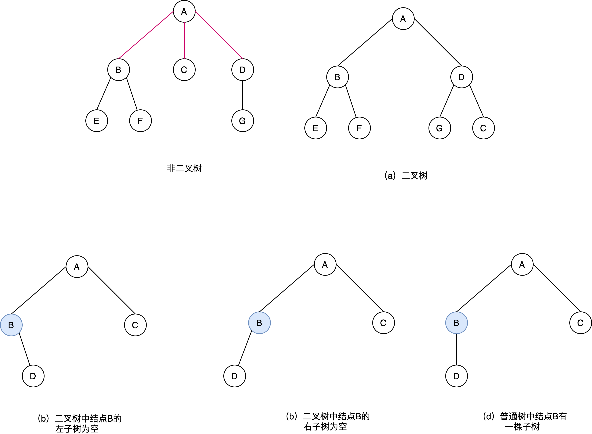
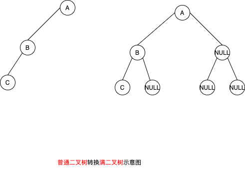
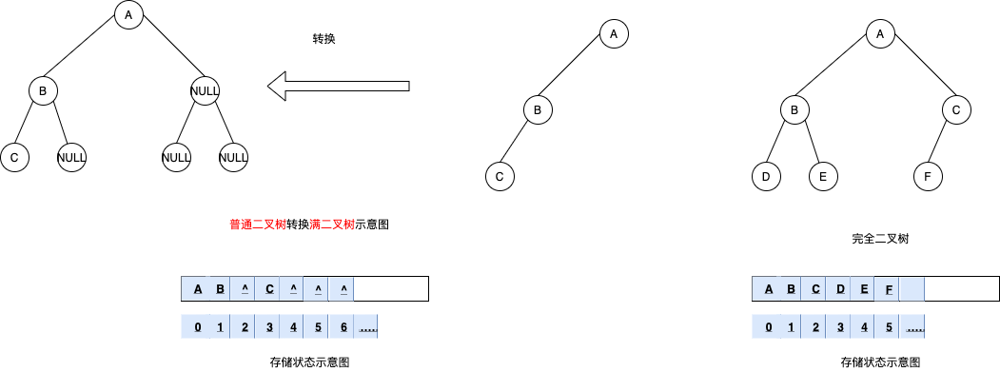
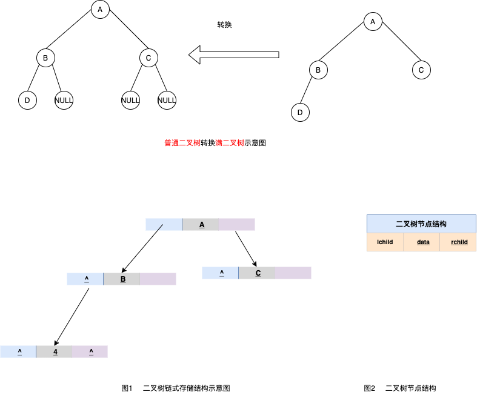
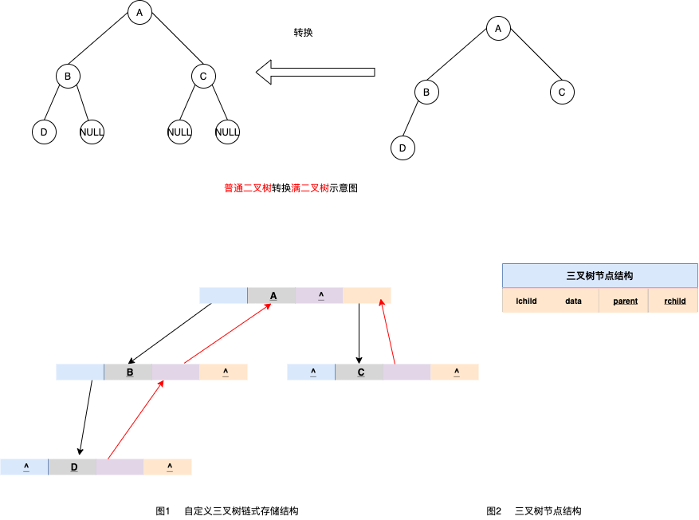
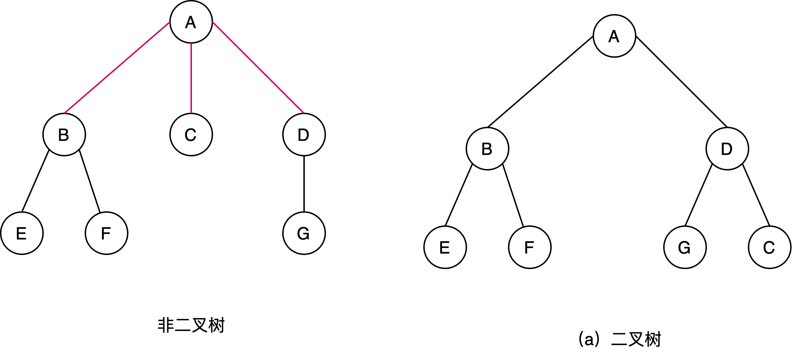
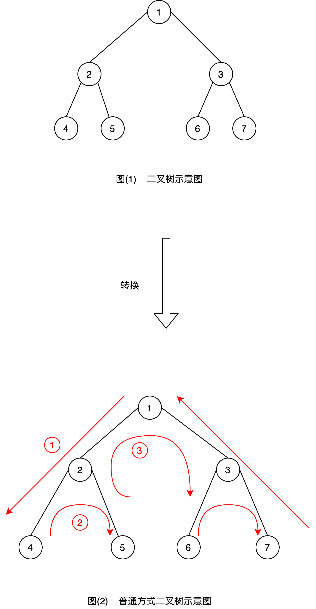

# 4.1.4.1 二叉树

## 什么是二叉树，二叉树及其性质详解

### 什么是二叉树

二叉树是 n(n >= 0) 个结点的有限集合，或是空树，或者是由一个根节点及两棵互不相交的且称为左、右子树的二叉树所组成。可见，二叉树同样具有递归性质。

需要注意的是，尽管树和二叉树的概念之间有许多联系，但它们是两个不同的概念。

<font color=red>树和二叉树的区别</font>

<table><tr><td bgcolor=PowderBlue>
二叉树中结点的子树要区分左子树和右子树，即使在结点只有一棵子树的情况下，也要明确指出该子树是左子树还是右子树

此外，二叉树结点最大度为2，而树中不限制结点的度数

</td></tr></table>




<table><tr><td bgcolor=PowderBlue>
简单地理解，满足以下两个条件的树就是二叉树：

1. 本身是有序树；
1. 树中包含的各个节点的度不能超过 2，即只能是 0、1 或者 2；
</td></tr></table>


### 二叉树的性质

经过前人的总结，二叉树具有以下几个性质：

1. 二叉树中，第 i 层最多有 $$ 2^{i}-1 $$ 个结点。
此性质只要对层数i进行数学归纳法证明即可
1. 如果二叉树的深度为 K，那么此二叉树最多有 $$ 2^{k}-1 $$ 个结点。
可由性质1，每一层的结点数都取最大值 $$ \sum_{i=1}^{k}{2^{i}-1} = 2^{k}-1  $$
1. 二叉树中，终端结点数（叶子结点数）为 n0，度为 2 的结点数为 n2，则 n0=n2+1。
1. 具有n个结点的完全二叉树的深度是 $$ \lbrace\log_2^{10}  \rbrace +1 $$


<table><tr><td bgcolor=PowderBlue>
性质3的计算方法为：对于一个二叉树来说，除了度为 0 的叶子结点和度为 2 的结点，剩下的就是度为 1 的结点（设为 n1），那么总结点 n=n0+n1+n2。
同时，对于每一个结点来说都是由其父结点分支表示的，假设树中分枝数为 B，那么总结点数 n=B+1。而分枝数是可以通过 n1 和 n2 表示的，即 B=n1+2*n2。所以，n 用另外一种方式表示为 n=n1+2*n2+1。
两种方式得到的 n 值组成一个方程组，就可以得出 n0=n2+1。
</td></tr></table>


二叉树还可以继续分类，衍生出`满二叉树`和`完全二叉树`。


### 满二叉树

<font color=red> 如果二叉树中除了叶子结点，每个结点的度都为 2，则此二叉树称为满二叉树。 </font>


如图所示就是一棵满二叉树。

1. 满二叉树除了满足普通二叉树的性质，还具有以下性质：
1. 满二叉树中第 i 层的节点数为 2n-1 个。
1. 深度为 k 的满二叉树必有 2k-1 个节点 ，叶子数为 2k-1。
1. 满二叉树中不存在度为 1 的节点，每一个分支点中都两棵深度相同的子树，且叶子节点都在最底层。
1. 具有 n 个节点的满二叉树的深度为 log2(n+1)。

### 完全二叉树

<font color=red> 如果二叉树中除去最后一层节点为满二叉树，且最后一层的结点依次从左到右分布，则此二叉树被称为 完全二叉树。</font>


完全二叉树除了具有普通二叉树的性质，它自身也具有一些独特的性质，比如说，n 个结点的完全二叉树的深度为 ⌊log2n⌋+1。

<table><tr><td bgcolor=PowderBlue>
⌊log2n⌋ 表示取小于 log2n 的最大整数。例如，⌊log24⌋ = 2，而 ⌊log25⌋ 结果也是 2。

</td></tr></table>


对于任意一个完全二叉树来说，如果将含有的结点按照层次从左到右依次标号（如图 3a)），对于任意一个结点 i ，完全二叉树还有以下几个结论成立：

1. 当 i>1 时，父亲结点为结点 [i/2] 。（i=1 时，表示的是根结点，无父亲结点）
1. 如果 2*i>n（总结点的个数） ，则结点 i 肯定没有左孩子（为叶子结点）；否则其左孩子是结点 2*i 。
1. 如果 2*i+1>n ，则结点 i 肯定没有右孩子；否则右孩子是结点 2*i+1 。


## 存储结构

二叉树的存储结构有两种，分别为顺序存储和链式存储。

### 二叉树的顺序存储结构

二叉树的顺序存储，指的是使用顺序表（数组）存储二叉树。需要注意的是，顺序存储只适用于完全二叉树。换句话说，只有完全二叉树才可以使用顺序表存储。

<font color=red>因此，如果我们想顺序存储普通二叉树，需要提前将普通二叉树转化为完全二叉树。</font>

>有读者会说，满二叉树也可以使用顺序存储。要知道，满二叉树也是完全二叉树，因为它满足完全二叉树的所有特征。

普通二叉树转完全二叉树的方法很简单，只需给二叉树额外添加一些节点，将其"拼凑"成完全二叉树即可。如图所示：





如图，左侧是普通二叉树，右侧是转换后的满二叉树；

**解决了二叉树的转化问题，接下来学习如何顺序存储完全二叉树?**


<font color=red>完全二叉树的顺序存储，仅需从根节点开始，按照层次依次将树中节点存储到数组即可。 </font> 


例如，存储如图所示完全二叉树，其存储状态如图




图左侧，普通二叉树转化而来的完全二叉树也是如此。这样我们就实现了完全二叉树的顺序存储。


不仅如此，从顺序表中还原完全二叉树也很简单，我们知道，完全二叉树性质，

<table><tr><td bgcolor=PowderBlue>
将书中即诶点按照层次顺序，从左到右以此标号(1、2、3、……)，若结点i有左右孩子，则其孩子结点为2*i;
右孩子即诶单为2*i+1。
</td></tr></table>

使用此性质，可用于还原数组中存储的完全二叉树，可以实现顺序存储逆向构建树的过程

此外关于二叉树的层次遍历，在后面会说明


对于深度为k的 `完全二叉树`， 除第k层外，其余各层中含有最大的结点数，即每一层的结点数恰为其上一层结点数的两倍，由此，从一个结点的编号可推理知道其 `双亲、左孩子、右孩子` 的编号

<font color=red> 假设有编号i的结点，则有: </font>

<table><tr><td bgcolor=PowderBlue>
 (1) 若 i=1，该结点为根结点，无双亲
 (2) 若 i>1, 该结点的双亲为 （i+1）/2 （取整数）
 (3) 若 $$ 2i \leq n $$ ， 则该结点的左孩子编号为2i，否则无左孩子
 (4) 若 $$ 2i+1 \leq n $$ ， 则该结点的右孩子编号为2i+1，否则无右孩子
 (5) 若 i 为奇数且不为1 ， 则该结点的左兄弟编号为 i-1 ，否则无左兄弟
 (4) 若 i 为偶数且小于n ， 则该结点的左兄弟编号为 i-1 ，否则无右兄弟
</td></tr></table>


显然，`完全二叉树` 采用顺序存储结构既简单又节省空间，对于一般的二叉树，则不宜采用顺序存储结构。因为一般的二叉树也必须按照完全二叉树的形式存储，也就是要添上一些实际上并不存在的 "虚结点"，这将造成空间的浪费

<font color=red> 在最坏情况下，一个深度为k且只有k个结点的二叉树（单支树）需要 $$ 2^{k}-1 $$ 个存储单元 </font>


### 二叉树的链式存储结构

上一节说明了`二叉树的顺序存储`，通过学习你会发现，其实二叉树并不适合用数组存储，因为并不是每个二叉树都是完全二叉树，使用顺序表存储会或多火烧存在空间浪费的现象


由于二叉树的结点中包含有数据元素、左子树的根、右子树的根及双亲等信息，因此可以用 `三叉链表` 或 `二叉链表`<font color=#008000>(既一个结点含有3个指针或两个指针)</font> 来存储二叉树，链表的头指针指向二叉树的根节点


先看看二叉树的链式存储结构，如图


此为一颗普通的二叉树，若将其采用链式存储，则只需从树的根结点开始，将各个结点及其左右孩子使用 `链表`存储即可。因此，图中对应的链式存储结构，如图所示



由图2可知，采用链式存储二叉树时，其结点结构由3部分构成(如图3)

1. 指向左孩子结点的指针(Lchild);
1. 结点存储的数据(data)
1. 指向右孩子结点的指针(Rchild);


**节点结构的 C 语言代码为：**

```c
typedef struct BiTNode{
    TElemType data;//数据域
    struct BiTNode *lchild,*rchild;//左右孩子指针
    struct BiTNode *parent;
}BiTNode,*BiTree;
```

**图2 中的链式存储结构对应的 C 语言代码为：**

```c
#include <stdio.h>
#include <stdlib.h>
#define TElemType int
typedef struct BiTNode{
    TElemType data;//数据域
    struct BiTNode *lchild,*rchild;//左右孩子指针
}BiTNode,*BiTree;
void CreateBiTree(BiTree *T){
    *T=(BiTNode*)malloc(sizeof(BiTNode));
    (*T)->data=A;
    (*T)->lchild=(BiTNode*)malloc(sizeof(BiTNode));
    (*T)->lchild->data=B;
    (*T)->rchild=(BiTNode*)malloc(sizeof(BiTNode));
    (*T)->rchild->data=C;
    (*T)->rchild->lchild=NULL;
    (*T)->rchild->rchild=NULL;
    (*T)->lchild->lchild=(BiTNode*)malloc(sizeof(BiTNode));
    (*T)->lchild->lchild->data=D;
    (*T)->lchild->rchild=NULL;
    (*T)->lchild->lchild->lchild=NULL;
    (*T)->lchild->lchild->rchild=NULL;
}
int main() {
    BiTree Tree;
    CreateBiTree(&Tree);
    printf("%d",Tree->lchild->lchild->data);
    return 0;
}

```

其实，二叉树的链式存储结构远不止图 2 所示的这一种。例如，在某些实际场景中，可能会做 "查找某节点的父节点" 的操作，这时可以在节点结构中再添加一个指针域，用于各个节点指向其父亲节点，如图1 所示：




```
这样的链表结构，通常称为三叉链表。
```

利用图 4 所示的三叉链表，我们可以很轻松地找到各节点的父节点。因此，在解决实际问题时，用合适的链表结构存储二叉树，可以起到事半功倍的效果。


<font color=red> 在不同的存储结构中，实现二叉树的运算方法也不同，具体应采用什么存储结构，除考虑二叉树的形态外还应该考虑需要进行运算的特点。</font>


## 浅谈二叉树的（4种）遍历算法

 遍历是二叉树按某种访问策略访问树中的每个结点，且仅访问一次的过程。
<table><tr><td bgcolor=PowderBlue>
   由于二叉树所具有的递归性质，一棵非空的二叉树是由根结点、左子树和右子树 三部分构成的，因此若能依次遍历这三部分，也就遍历了整棵二叉树。按照先序、中序、和后序、层序遍历 4 种遍历方法
</td></tr></table>

遍历都是遇到根结点打印

先序: <font color=red>根</font>左右
中序: 左<font color=red>根</font>右
后续: 左右<font color=red>根</font>

二叉树结点定义
```c
//构造结点的结构体
typedef struct BiTNode{
    T data;//数据域
    struct BiTNode *lchild,*rchild;//左右孩子指针
}BiTNode,*BiTree;

```

## 遍历二叉树的算法



图(a)，是一棵二叉树，对于初学者而言遍历这棵二叉树无非有以下 2 种方式


### 层次遍历

前面讲过，树是有层次的，拿图(a) 来说，该二叉树的层次为 3。

<font color=#008000>层次遍历</font> :通过对树中各层的节点从左到右依次遍历，即可实现对正棵二叉树的遍历，此种方式称为层次遍历。

比如，对图(1) 中二叉树进行层次遍历，遍历过程如图所示：


### 普通遍历

其实，还有一种更普通的遍历二叉树的思想，即按照 "从上到下，从左到右" 的顺序遍历整棵二叉树。

还拿图 1 中的二叉树举例，其遍历过程如图所示：


以上仅是从初学者的角度，对遍历二叉树的过程进行了分析。接下来我们从程序员的角度再对以上两种遍历方式进行剖析。

> 这里，我们要建立一个共识，即成功遍历二叉树的标志是能够成功访问到二叉树中所有的节点。


##  进一步剖析二叉树遍历算法

首先观察图 2 中的层次遍历，整个遍历过程只经过各个节点一次，因此在层次遍历过程，每经过一个节点，都必须立刻访问该节点，否则错失良机，后续无法再对其访问。


若对图 1 中二叉树进行层次遍历，则访问树中节点的次序为：

```shell
1 2 3 4 5 6 7
```


而普通遍历方式则不同，通过观察图可以看到，整个遍历二叉树的过程中，每个节点都被经过了 `3` 次（虽然叶子节点看似只经过了 `2` 次，但实际上可以看做是 `3` 次）。以图中的 `节点2` 为例，如图所示，它被经过了 `3` 次。




因此，在编程实现时，我们可以设定真正访问各个节点的时机，换句话说，我们既可以在第一次经过各节点时就执行访问程序，也可以在第二次经过各节点时访问，甚至可以在最后一次经过各节点时访问。


<font color=red>这也就引出了以下 3 种遍历二叉树的算法： </font>

<table><tr><td bgcolor=PowderBlue>
1. <font color=red>先序遍历</font>：每遇到一个节点，先访问，然后再遍历其左右子树（对应图 4 中的 ①）；

2. <font color=red>中序遍历</font>：第一次经过时不访问，等遍历完左子树之后再访问，然后遍历右子树（对应图 4 中的 ②）；

3. <font color=red>后序遍历</font>：第一次和第二次经过时都不访问，等遍历完该节点的左右子树之后，最后访问该节点（对应图 4 中的 ③）；
</td></tr></table>

以图 1 中的二叉树为例，其先序遍历算法访问节点的先后次序为：


> 1 2 4 5 3 6 7

中序遍历算法访问节点的次序为：

> 4 2 5 1 6 3 7

后序遍历访问节点的次序为：

> 4 5 2 6 7 3 1

以上就是二叉树 4 种遍历算法的由来，其各个算法的具体实现过程其代码实现后续章节会详解介绍。


## 二叉树的先序遍历

二叉树先序遍历的实现思想是：

<table><tr><td bgcolor=PowderBlue>
    1. 访问根节点；
    2. 访问当前节点的左子树；
    3. 若当前节点无左子树，则访问当前节点的右子树；
</td></tr></table>


### 递归实现

二叉树的先序遍历采用的是递归的思想，因此可以递归实现，其 C 语言实现代码为：

```c
#include <stdio.h>
#include <string.h>
#define TElemType int
//构造结点的结构体
typedef struct BiTNode{
    TElemType data;//数据域
    struct BiTNode *lchild,*rchild;//左右孩子指针
}BiTNode,*BiTree;
//初始化树的函数
void CreateBiTree(BiTree *T){
    *T=(BiTNode*)malloc(sizeof(BiTNode));
    (*T)->data=1;
    (*T)->lchild=(BiTNode*)malloc(sizeof(BiTNode));
    (*T)->rchild=(BiTNode*)malloc(sizeof(BiTNode));
  
    (*T)->lchild->data=2;
    (*T)->lchild->lchild=(BiTNode*)malloc(sizeof(BiTNode));
    (*T)->lchild->rchild=(BiTNode*)malloc(sizeof(BiTNode));
    (*T)->lchild->rchild->data=5;
    (*T)->lchild->rchild->lchild=NULL;
    (*T)->lchild->rchild->rchild=NULL;
    (*T)->rchild->data=3;
    (*T)->rchild->lchild=(BiTNode*)malloc(sizeof(BiTNode));
    (*T)->rchild->lchild->data=6;
    (*T)->rchild->lchild->lchild=NULL;
    (*T)->rchild->lchild->rchild=NULL;
    (*T)->rchild->rchild=(BiTNode*)malloc(sizeof(BiTNode));
    (*T)->rchild->rchild->data=7;
    (*T)->rchild->rchild->lchild=NULL;
    (*T)->rchild->rchild->rchild=NULL;
    (*T)->lchild->lchild->data=4;
    (*T)->lchild->lchild->lchild=NULL;
    (*T)->lchild->lchild->rchild=NULL;
}
//模拟操作结点元素的函数，输出结点本身的数值
void displayElem(BiTNode* elem){
    printf("%d ",elem->data);
}
//先序遍历
void PreOrderTraverse(BiTree T){
    if (T) {
        displayElem(T);//调用操作结点数据的函数方法
        PreOrderTraverse(T->lchild);//访问该结点的左孩子
        PreOrderTraverse(T->rchild);//访问该结点的右孩子
    }
    //如果结点为空，返回上一层
    return;
}
int main() {
    BiTree Tree;
    CreateBiTree(&Tree);
    printf("先序遍历: \n");
    PreOrderTraverse(Tree);
}
```

### 递归实现

二叉树的先序遍历采用的是递归的思想，因此可以递归实现，其 C 语言实现代码为：

```c
#include <stdio.h>
#include <string.h>
#define TElemType int
int top=-1;//top变量时刻表示栈顶元素所在位置
//构造结点的结构体
typedef struct BiTNode{
    TElemType data;//数据域
    struct BiTNode *lchild,*rchild;//左右孩子指针
}BiTNode,*BiTree;
//初始化树的函数
void CreateBiTree(BiTree *T){
    *T=(BiTNode*)malloc(sizeof(BiTNode));
    (*T)->data=1;
    (*T)->lchild=(BiTNode*)malloc(sizeof(BiTNode));
    (*T)->rchild=(BiTNode*)malloc(sizeof(BiTNode));
    (*T)->lchild->data=2;
    (*T)->lchild->lchild=(BiTNode*)malloc(sizeof(BiTNode));
    (*T)->lchild->rchild=(BiTNode*)malloc(sizeof(BiTNode));
    (*T)->lchild->rchild->data=5;
    (*T)->lchild->rchild->lchild=NULL;
    (*T)->lchild->rchild->rchild=NULL;
    (*T)->rchild->data=3;
    (*T)->rchild->lchild=(BiTNode*)malloc(sizeof(BiTNode));
    (*T)->rchild->lchild->data=6;
    (*T)->rchild->lchild->lchild=NULL;
    (*T)->rchild->lchild->rchild=NULL;
    (*T)->rchild->rchild=(BiTNode*)malloc(sizeof(BiTNode));
    (*T)->rchild->rchild->data=7;
    (*T)->rchild->rchild->lchild=NULL;
    (*T)->rchild->rchild->rchild=NULL;
    (*T)->lchild->lchild->data=4;
    (*T)->lchild->lchild->lchild=NULL;
    (*T)->lchild->lchild->rchild=NULL;
}
//前序遍历使用的进栈函数
void push(BiTNode** a,BiTNode* elem){
    a[++top]=elem;
}
//弹栈函数
void pop( ){
    if (top==-1) {
        return ;
    }
    top--;
}
//模拟操作结点元素的函数，输出结点本身的数值
void displayElem(BiTNode* elem){
    printf("%d ",elem->data);
}
//拿到栈顶元素
BiTNode* getTop(BiTNode**a){
    return a[top];
}
//先序遍历非递归算法
void PreOrderTraverse(BiTree Tree){
    BiTNode* a[20];//定义一个顺序栈
    BiTNode * p;//临时指针
    push(a, Tree);//根结点进栈
    while (top!=-1) {
        p=getTop(a);//取栈顶元素
        pop();//弹栈
        while (p) {
            displayElem(p);//调用结点的操作函数
            //如果该结点有右孩子，右孩子进栈
            if (p->rchild) {
                push(a,p->rchild);
            }
            p=p->lchild;//一直指向根结点最后一个左孩子
        }
    }
}
int main(){
    BiTree Tree;
    CreateBiTree(&Tree);
    printf("先序遍历: \n");
    PreOrderTraverse(Tree);
}
```

## 二叉树的中序遍历


二叉树中序遍历的实现思想是：


<table><tr><td bgcolor=PowderBlue>
    1. 访问当前节点的左子树；
    2. 访问根节点；
    3. 访问当前节点的右子树；
</td></tr></table>


 
以图1 为例，采用中序遍历的思想遍历该二叉树的过程为：

1. 访问该二叉树的根节点，找到 1；
1. 遍历节点 1 的左子树，找到节点 2；
1. 遍历节点 2 的左子树，找到节点 4；
1. 由于节点 4 无左孩子，因此找到节点 4，并遍历节点 4 的右子树；
1. 由于节点 4 无右子树，因此节点 2 的左子树遍历完成，访问节点 2；
1. 遍历节点 2 的右子树，找到节点 5；
1. 由于节点 5 无左子树，因此访问节点 5 ，又因为节点 5 没有右子树，因此节点 1 的左子树遍历完成，访问节点 1 ，并遍历节点 1 的右子树，找到节点 3；
1. 遍历节点 3 的左子树，找到节点 6；
1. 由于节点 6 无左子树，因此访问节点 6，又因为该节点无右子树，因此节点 3 的左子树遍历完成，开始访问节点 3 ，并遍历节点 3 的右子树，找到节点 7；
1. 由于节点 7 无左子树，因此访问节点 7，又因为该节点无右子树，因此节点 1 的右子树遍历完成，即整棵树遍历完成；


因此，图 1 中二叉树采用中序遍历得到的序列为：

> 4 2 5 1 6 3 7


### 递归实现

二叉树的中序遍历采用的是递归的思想，因此可以递归实现，其 C 语言实现代码为：


```c
#include <stdio.h>
#include <string.h>
#define TElemType int
//构造结点的结构体
typedef struct BiTNode{
    TElemType data;//数据域
    struct BiTNode *lchild,*rchild;//左右孩子指针
}BiTNode,*BiTree;
//初始化树的函数
void CreateBiTree(BiTree *T){
    *T=(BiTNode*)malloc(sizeof(BiTNode));
    (*T)->data=1;
    (*T)->lchild=(BiTNode*)malloc(sizeof(BiTNode));
    (*T)->rchild=(BiTNode*)malloc(sizeof(BiTNode));
  
    (*T)->lchild->data=2;
    (*T)->lchild->lchild=(BiTNode*)malloc(sizeof(BiTNode));
    (*T)->lchild->rchild=(BiTNode*)malloc(sizeof(BiTNode));
    (*T)->lchild->rchild->data=5;
    (*T)->lchild->rchild->lchild=NULL;
    (*T)->lchild->rchild->rchild=NULL;
    (*T)->rchild->data=3;
    (*T)->rchild->lchild=(BiTNode*)malloc(sizeof(BiTNode));
    (*T)->rchild->lchild->data=6;
    (*T)->rchild->lchild->lchild=NULL;
    (*T)->rchild->lchild->rchild=NULL;
    (*T)->rchild->rchild=(BiTNode*)malloc(sizeof(BiTNode));
    (*T)->rchild->rchild->data=7;
    (*T)->rchild->rchild->lchild=NULL;
    (*T)->rchild->rchild->rchild=NULL;
    (*T)->lchild->lchild->data=4;
    (*T)->lchild->lchild->lchild=NULL;
    (*T)->lchild->lchild->rchild=NULL;
}

//模拟操作结点元素的函数，输出结点本身的数值
void displayElem(BiTNode* elem){
    printf("%d ",elem->data);
}
//中序遍历
void INOrderTraverse(BiTree T){
    if (T) {
        INOrderTraverse(T->lchild);//遍历左孩子
        displayElem(T);//调用操作结点数据的函数方法
        INOrderTraverse(T->rchild);//遍历右孩子
    }
    //如果结点为空，返回上一层
    return;
}
int main() {
    BiTree Tree;
    CreateBiTree(&Tree);
    printf("中序遍历算法: \n");
    INOrderTraverse(Tree);
}
```

### 非递归实现

而递归的底层实现依靠的是栈存储结构，因此，二叉树的先序遍历既可以直接采用递归思想实现，也可以使用栈的存储结构模拟递归的思想实现。

中序遍历的非递归方式实现思想是：

> 从根结点开始，遍历左孩子同时压栈，当遍历结束，说明当前遍历的结点没有左孩子，从栈中取出来调用操作函数，然后访问该结点的右孩子，继续以上重复性的操作。

除此之外，还有另一种实现思想：

> 中序遍历过程中，只需将每个结点的左子树压栈即可，右子树不需要压栈。当结点的左子树遍历完成后，只需要以栈顶结点的右孩子为根结点，继续循环遍历即可。

两种非递归方法实现二叉树中序遍历的代码实现为：


```c
#include <stdio.h>
#include <string.h>
#define TElemType int
int top=-1;//top变量时刻表示栈顶元素所在位置
//构造结点的结构体
typedef struct BiTNode{
    TElemType data;//数据域
    struct BiTNode *lchild,*rchild;//左右孩子指针
}BiTNode,*BiTree;
//初始化树的函数
void CreateBiTree(BiTree *T){
    *T=(BiTNode*)malloc(sizeof(BiTNode));
    (*T)->data=1;
    (*T)->lchild=(BiTNode*)malloc(sizeof(BiTNode));
    (*T)->rchild=(BiTNode*)malloc(sizeof(BiTNode));
    (*T)->lchild->data=2;
    (*T)->lchild->lchild=(BiTNode*)malloc(sizeof(BiTNode));
    (*T)->lchild->rchild=(BiTNode*)malloc(sizeof(BiTNode));
    (*T)->lchild->rchild->data=5;
    (*T)->lchild->rchild->lchild=NULL;
    (*T)->lchild->rchild->rchild=NULL;
    (*T)->rchild->data=3;
    (*T)->rchild->lchild=(BiTNode*)malloc(sizeof(BiTNode));
    (*T)->rchild->lchild->data=6;
    (*T)->rchild->lchild->lchild=NULL;
    (*T)->rchild->lchild->rchild=NULL;
    (*T)->rchild->rchild=(BiTNode*)malloc(sizeof(BiTNode));
    (*T)->rchild->rchild->data=7;
    (*T)->rchild->rchild->lchild=NULL;
    (*T)->rchild->rchild->rchild=NULL;
    (*T)->lchild->lchild->data=4;
    (*T)->lchild->lchild->lchild=NULL;
    (*T)->lchild->lchild->rchild=NULL;
}
//前序和中序遍历使用的进栈函数
void push(BiTNode** a,BiTNode* elem){
    a[++top]=elem;
}

//弹栈函数
void pop( ){
    if (top==-1) {
        return ;
    }
    top--;
}
//模拟操作结点元素的函数，输出结点本身的数值
void displayElem(BiTNode* elem){
    printf("%d ",elem->data);
}
//拿到栈顶元素
BiTNode* getTop(BiTNode**a){
    return a[top];
}
//中序遍历非递归算法
void InOrderTraverse1(BiTree Tree){
    BiTNode* a[20];//定义一个顺序栈
    BiTNode * p;//临时指针
    push(a, Tree);//根结点进栈
    while (top!=-1) {//top!=-1说明栈内不为空，程序继续运行
        while ((p=getTop(a)) &&p){//取栈顶元素，且不能为NULL
            push(a, p->lchild);//将该结点的左孩子进栈，如果没有左孩子，NULL进栈
        }
        pop();//跳出循环，栈顶元素肯定为NULL，将NULL弹栈
        if (top!=-1) {
            p=getTop(a);//取栈顶元素
            pop();//栈顶元素弹栈
            displayElem(p);
            push(a, p->rchild);//将p指向的结点的右孩子进栈
        }
    }
}

//中序遍历实现的另一种方法
void InOrderTraverse2(BiTree Tree){
    BiTNode* a[20];//定义一个顺序栈
    BiTNode * p;//临时指针
    p=Tree;
    //当p为NULL或者栈为空时，表明树遍历完成
    while (p || top!=-1) {
        //如果p不为NULL，将其压栈并遍历其左子树
        if (p) {
            push(a, p);
            p=p->lchild;
        }
        //如果p==NULL，表明左子树遍历完成，需要遍历上一层结点的右子树
        else{
            p=getTop(a);
            pop();
            displayElem(p);
            p=p->rchild;
        }
    }
}
int main(){
    BiTree Tree;
    CreateBiTree(&Tree);
    printf("\n中序遍历算法1: \n");
    InOrderTraverse1(Tree);
    printf("\n中序遍历算法2: \n");
    InOrderTraverse2(Tree);
}


```


## 二叉树的后序遍历


二叉树后序遍历的实现思想是：

<table><tr><td bgcolor=PowderBlue>
    1. 访问根节点；
    2. 访问当前节点的左子树；
    3. 访问当前节点的右子树；
</td></tr></table>

从根节点出发，依次遍历各节点的左右子树，直到当前节点左右子树遍历完成后，才访问该节点元素。


如图 1 中，对此二叉树进行后序遍历的操作过程为：

1. 从根节点 1 开始，遍历该节点的左子树（以节点 2 为根节点）；
1. 遍历节点 2 的左子树（以节点 4 为根节点）；
1. 由于节点 4 既没有左子树，也没有右子树，此时访问该节点中的元素 4，并回退到节点 2 ，遍历节点 2 的右子树（以 5 为根节点）；
1. 由于节点 5 无左右子树，因此可以访问节点 5 ，并且此时节点 2 的左右子树也遍历完成，因此也可以访问节点 2；
1. 此时回退到节点 1 ，开始遍历节点 1 的右子树（以节点 3 为根节点）；
1. 遍历节点 3 的左子树（以节点 6 为根节点）；
1. 由于节点 6 无左右子树，因此访问节点 6，并回退到节点 3，开始遍历节点 3 的右子树（以节点 7 为根节点）；
1. 由于节点 7 无左右子树，因此访问节点 7，并且节点 3 的左右子树也遍历完成，可以访问节点 3；节点 1 的左右子树也遍历完成，可以访问节点 1；
1. 到此，整棵树的遍历结束。


由此，对图 1 中二叉树进行后序遍历的结果为：

> 4 5 2 6 7 3 1

### 递归实现

二叉树的后序遍历采用的是递归的思想，因此可以递归实现，其 C 语言实现代码为：

```c
#include <stdio.h>
#include <string.h>
#define TElemType int
//构造结点的结构体
typedef struct BiTNode{
    TElemType data;//数据域
    struct BiTNode *lchild,*rchild;//左右孩子指针
}BiTNode,*BiTree;
//初始化树的函数
void CreateBiTree(BiTree *T){
    *T=(BiTNode*)malloc(sizeof(BiTNode));
    (*T)->data=1;
    (*T)->lchild=(BiTNode*)malloc(sizeof(BiTNode));
    (*T)->rchild=(BiTNode*)malloc(sizeof(BiTNode));
  
    (*T)->lchild->data=2;
    (*T)->lchild->lchild=(BiTNode*)malloc(sizeof(BiTNode));
    (*T)->lchild->rchild=(BiTNode*)malloc(sizeof(BiTNode));
    (*T)->lchild->rchild->data=5;
    (*T)->lchild->rchild->lchild=NULL;
    (*T)->lchild->rchild->rchild=NULL;
    (*T)->rchild->data=3;
    (*T)->rchild->lchild=(BiTNode*)malloc(sizeof(BiTNode));
    (*T)->rchild->lchild->data=6;
    (*T)->rchild->lchild->lchild=NULL;
    (*T)->rchild->lchild->rchild=NULL;
    (*T)->rchild->rchild=(BiTNode*)malloc(sizeof(BiTNode));
    (*T)->rchild->rchild->data=7;
    (*T)->rchild->rchild->lchild=NULL;
    (*T)->rchild->rchild->rchild=NULL;
    (*T)->lchild->lchild->data=4;
    (*T)->lchild->lchild->lchild=NULL;
    (*T)->lchild->lchild->rchild=NULL;
}

#include <stdio.h>
#include <string.h>
#define TElemType int
//构造结点的结构体
typedef struct BiTNode{
    TElemType data;//数据域
    struct BiTNode *lchild,*rchild;//左右孩子指针
}BiTNode,*BiTree;
//初始化树的函数
void CreateBiTree(BiTree *T){
    *T=(BiTNode*)malloc(sizeof(BiTNode));
    (*T)->data=1;
    (*T)->lchild=(BiTNode*)malloc(sizeof(BiTNode));
    (*T)->rchild=(BiTNode*)malloc(sizeof(BiTNode));
  
    (*T)->lchild->data=2;
    (*T)->lchild->lchild=(BiTNode*)malloc(sizeof(BiTNode));
    (*T)->lchild->rchild=(BiTNode*)malloc(sizeof(BiTNode));
    (*T)->lchild->rchild->data=5;
    (*T)->lchild->rchild->lchild=NULL;
    (*T)->lchild->rchild->rchild=NULL;
    (*T)->rchild->data=3;
    (*T)->rchild->lchild=(BiTNode*)malloc(sizeof(BiTNode));
    (*T)->rchild->lchild->data=6;
    (*T)->rchild->lchild->lchild=NULL;
    (*T)->rchild->lchild->rchild=NULL;
    (*T)->rchild->rchild=(BiTNode*)malloc(sizeof(BiTNode));
    (*T)->rchild->rchild->data=7;
    (*T)->rchild->rchild->lchild=NULL;
    (*T)->rchild->rchild->rchild=NULL;
    (*T)->lchild->lchild->data=4;
    (*T)->lchild->lchild->lchild=NULL;
    (*T)->lchild->lchild->rchild=NULL;
}

```


### 非递归实现

递归算法底层的实现使用的是栈存储结构，所以可以直接使用栈写出相应的非递归算法。

后序遍历是在遍历完当前结点的左右孩子之后，才调用操作函数，所以需要在操作结点进栈时，为每个结点配备一个标志位。当遍历该结点的左孩子时，设置当前结点的标志位为 0，进栈；当要遍历该结点的右孩子时，设置当前结点的标志位为 1，进栈。

这样，当遍历完成，该结点弹栈时，查看该结点的标志位的值：如果是 0，表示该结点的右孩子还没有遍历；反之如果是 1，说明该结点的左右孩子都遍历完成，可以调用操作函数。


完整实现代码为：


```c
#include <stdio.h>
#include <string.h>
#define TElemType int
int top=-1;//top变量时刻表示栈顶元素所在位置
//构造结点的结构体
typedef struct BiTNode{
    TElemType data;//数据域
    struct BiTNode *lchild,*rchild;//左右孩子指针
}BiTNode,*BiTree;
//初始化树的函数
void CreateBiTree(BiTree *T){
    *T=(BiTNode*)malloc(sizeof(BiTNode));
    (*T)->data=1;
    (*T)->lchild=(BiTNode*)malloc(sizeof(BiTNode));
    (*T)->rchild=(BiTNode*)malloc(sizeof(BiTNode));
    (*T)->lchild->data=2;
    (*T)->lchild->lchild=(BiTNode*)malloc(sizeof(BiTNode));
    (*T)->lchild->rchild=(BiTNode*)malloc(sizeof(BiTNode));
    (*T)->lchild->rchild->data=5;
    (*T)->lchild->rchild->lchild=NULL;
    (*T)->lchild->rchild->rchild=NULL;
    (*T)->rchild->data=3;
    (*T)->rchild->lchild=(BiTNode*)malloc(sizeof(BiTNode));
    (*T)->rchild->lchild->data=6;
    (*T)->rchild->lchild->lchild=NULL;
    (*T)->rchild->lchild->rchild=NULL;
    (*T)->rchild->rchild=(BiTNode*)malloc(sizeof(BiTNode));
    (*T)->rchild->rchild->data=7;
    (*T)->rchild->rchild->lchild=NULL;
    (*T)->rchild->rchild->rchild=NULL;
    (*T)->lchild->lchild->data=4;
    (*T)->lchild->lchild->lchild=NULL;
    (*T)->lchild->lchild->rchild=NULL;
}
//弹栈函数
void pop( ){
    if (top==-1) {
        return ;
    }
    top--;
}
//模拟操作结点元素的函数，输出结点本身的数值
void displayElem(BiTNode* elem){
    printf("%d ",elem->data);
}
//后序遍历非递归算法
typedef struct SNode{
    BiTree p;
    int tag;
}SNode;
//后序遍历使用的进栈函数
void postpush(SNode *a,SNode sdata){
    a[++top]=sdata;
}
//后序遍历函数
void PostOrderTraverse(BiTree Tree){
    SNode a[20];//定义一个顺序栈
    BiTNode * p;//临时指针
    int tag;
    SNode sdata;
    p=Tree;
    while (p||top!=-1) {
        while (p) {
            //为该结点入栈做准备
            sdata.p=p;
            sdata.tag=0;//由于遍历是左孩子，设置标志位为0
            postpush(a, sdata);//压栈
            p=p->lchild;//以该结点为根结点，遍历左孩子
        }
        sdata=a[top];//取栈顶元素
        pop();//栈顶元素弹栈
        p=sdata.p;
        tag=sdata.tag;
        //如果tag==0，说明该结点还没有遍历它的右孩子
        if (tag==0) {
            sdata.p=p;
            sdata.tag=1;
            postpush(a, sdata);//更改该结点的标志位，重新压栈
            p=p->rchild;//以该结点的右孩子为根结点，重复循环
        }
        //如果取出来的栈顶元素的tag==1，说明此结点左右子树都遍历完了，可以调用操作函数了
        else{
            displayElem(p);
            p=NULL;
        }
    }
}
int main(){
    BiTree Tree;
    CreateBiTree(&Tree);
    printf("后序遍历: \n");
    PostOrderTraverse(Tree);
}
```

## 二叉树的层次遍历

前边介绍了二叉树的先序、中序和后序的遍历算法，运用了栈的数据结构，主要思想就是按照先左子树后右子树的顺序依次遍历树中各个结点。

本节介绍另外一种遍历方式：按照二叉树中的层次从左到右依次遍历每层中的结点。具体的实现思路是：通过使用队列的数据结构，从树的根结点开始，依次将其左孩子和右孩子入队。而后每次队列中一个结点出队，都将其左孩子和右孩子入队，直到树中所有结点都出队，出队结点的先后顺序就是层次遍历的最终结果。


### 层次遍历的实现过程


例如，层次遍历图 1 中的二叉树：

1. 首先，根结点 1 入队；
1. 根结点 1 出队，出队的同时，将左孩子 2 和右孩子 3 分别入队；
1. 队头结点 2 出队，出队的同时，将结点 2 的左孩子 4 和右孩子 5 依次入队；
1. 队头结点 3 出队，出队的同时，将结点 3 的左孩子 6 和右孩子 7 依次入队；
1. 不断地循环，直至队列内为空。


```c
#include <stdio.h>
#define TElemType int
//初始化队头和队尾指针开始时都为0
int front=0,rear=0;
typedef struct BiTNode{
    TElemType data;//数据域
    struct BiTNode *lchild,*rchild;//左右孩子指针
}BiTNode,*BiTree;
void CreateBiTree(BiTree *T){
    *T=(BiTNode*)malloc(sizeof(BiTNode));
    (*T)->data=1;
    (*T)->lchild=(BiTNode*)malloc(sizeof(BiTNode));
    (*T)->rchild=(BiTNode*)malloc(sizeof(BiTNode));
   
    (*T)->lchild->data=2;
    (*T)->lchild->lchild=(BiTNode*)malloc(sizeof(BiTNode));
    (*T)->lchild->rchild=(BiTNode*)malloc(sizeof(BiTNode));
    (*T)->lchild->rchild->data=5;
    (*T)->lchild->rchild->lchild=NULL;
    (*T)->lchild->rchild->rchild=NULL;
   
    (*T)->rchild->data=3;
    (*T)->rchild->lchild=(BiTNode*)malloc(sizeof(BiTNode));
    (*T)->rchild->lchild->data=6;
    (*T)->rchild->lchild->lchild=NULL;
    (*T)->rchild->lchild->rchild=NULL;
   
    (*T)->rchild->rchild=(BiTNode*)malloc(sizeof(BiTNode));
    (*T)->rchild->rchild->data=7;
    (*T)->rchild->rchild->lchild=NULL;
    (*T)->rchild->rchild->rchild=NULL;
   
    (*T)->lchild->lchild->data=4;
    (*T)->lchild->lchild->lchild=NULL;
    (*T)->lchild->lchild->rchild=NULL;
}
//入队函数
void EnQueue(BiTree *a,BiTree node){
    a[rear++]=node;
}
//出队函数
BiTNode* DeQueue(BiTNode** a){
    return a[front++];
}
//输出函数
void displayNode(BiTree node){
    printf("%d ",node->data);
}
int main() {
    BiTree tree;
    //初始化二叉树
    CreateBiTree(&tree);
    BiTNode * p;
    //采用顺序队列，初始化一个空队列
    BiTree a[20];
    //根结点入队
    EnQueue(a, tree);
    //当队头和队尾相等时，表示队列为空
    while(front<rear) {
        //队头结点出队
        p=DeQueue(a);
        displayNode(p);
        //将队头结点的左右孩子依次入队
        if (p->lchild!=NULL) {
            EnQueue(a, p->lchild);
        }
        if (p->rchild!=NULL) {
            EnQueue(a, p->rchild);
        }
    }
    return 0;
}

```

