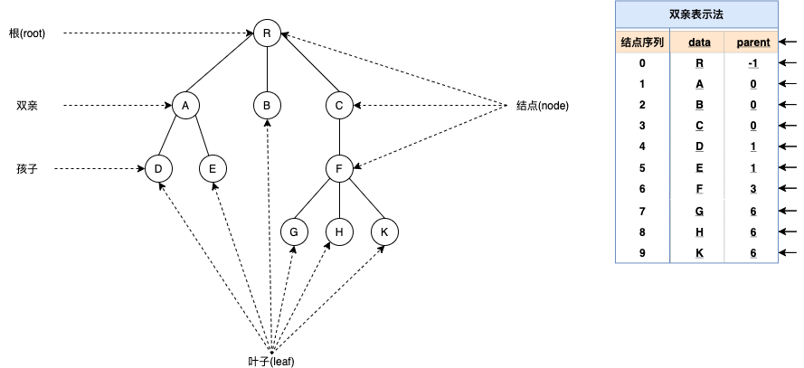
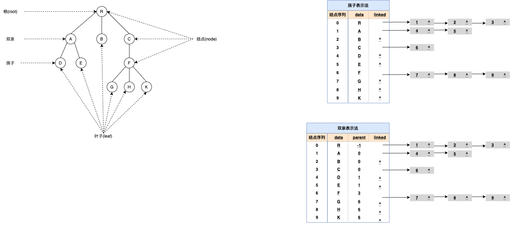
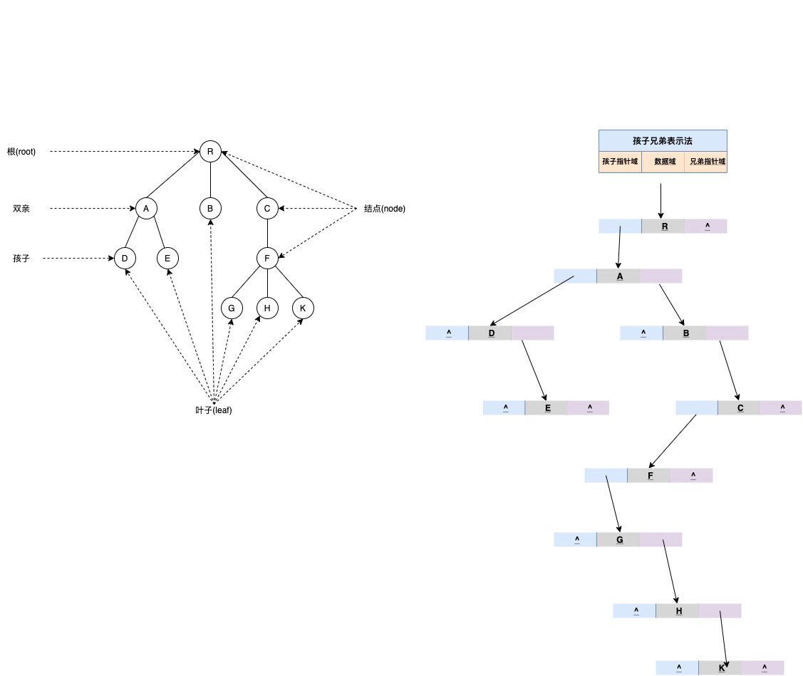

# 4.1.4 树

树是数据结构中比较重要也是比较难理解的一类存储结构。本章主要主要围绕二叉树，对树的存储以及遍历做详细的介绍，同时还会涉及到有关树的实际应用，例如构建哈弗曼编码等。

由于树存储结构本身比较复杂，需要有耐心地去搞清楚每一节中的每个知识点，在学习时，建议从每节的问题出发，搞清楚文章的解题思路。

## 树的定义

树是n(n>=0) 个节点的有限集合，当 n=0 时称为空树。在任一非空树（n>0）中，有且仅有一个根的结点；秋雨可分为m (m >= 0)个互不相交的有限子集 T1，T2，……， Tm ， 其中，每个Ti 又都是一颗树，并且称为根节点的子树。

树的定义是递归的，它表明了树的固有特性，也就是一棵树由若干个子树构成，而子树又由更小的子树组成

该定义只给出了树的组成特点，若从数据结构的逻辑关系角度来看，树中元素之间有明显的层次关系。对于树中某个结点，它最多和上一层的一个结点（既其双亲结点）有直接的关系，而与其下一层的多个结点（即其孩子结点）有直接关系，如图所示。通常，凡是分等级的分类方案都可以用具有严格层次关系的树结构来描述。


## 数据结构中的树存储结构

本章所介绍的树结构是一种非线性存储结构，存储的是具有“一对多”关系的数据元素的集合。


图 1(A) 是使用树结构存储的集合 {A,B,C,D,E,F,G,H,I,J,K,L,M} 的示意图。对于数据 A 来说，和数据 B、C、D 有关系；对于数据 B 来说，和 E、F 有关系。这就是“一对多”的关系。

将具有“一对多”关系的集合中的数据元素按照图1（A）的形式进行存储，整个存储形状在逻辑结构上看，类似于实际生活中倒着的树（图1（B）倒过来），所以称这种存储结构为“树型”存储结构。

### 树的结点

**<font color=#008000>结点</font>**：使用树结构存储的每一个数据元素都被称为“结点”。例如，图 1（A）中，数据元素 A 就是一个结点；

**<font color=#008000>父结点（双亲结点）、子结点和兄弟结点</font> **：对于图 1（A）中的结点 A、B、C、D 来说，A 是 B、C、D 结点的父结点（也称为“双亲结点”），而 B、C、D 都是 A 结点的子结点（也称“孩子结点”）。对于 B、C、D 来说，它们都有相同的父结点，所以它们互为兄弟结点。

**<font color=#008000>结点（简称“根结点”）</font> **：每一个非空树都有且只有一个被称为根的结点。图 1（A）中，结点A就是整棵树的根结点。

<table><tr><td bgcolor=PowderBlue>树根的判断依据为：如果一个结点没有父结点，那么这个结点就是整棵树的根结点。</td></tr></table>

**<font color=#008000>叶子结点</font>**：如果结点没有任何子结点，那么此结点称为叶子结点（叶结点）。例如图 1（A）中，结点 K、L、F、G、M、I、J 都是这棵树的叶子结点。

### 子树和空树


**子树**：如图 1（A）中，整棵树的根结点为结点 A，而如果单看结点 B、E、F、K、L 组成的部分来说，也是棵树，而且节点 B 为这棵树的根结点。所以称 B、E、F、K、L 这几个结点组成的树为整棵树的子树；同样，结点 E、K、L 构成的也是一棵子树，根结点为 E。

<table><tr><td bgcolor=PowderBlue><font color=red>树根的判断依据为：</font>如果一个结点没有父结点，那么这个结点就是整棵树的根结点。</td></tr></table>

知道了子树的概念后，树也可以这样定义：树是由根结点和若干棵子树构成的。


**空树**：如果集合本身为空，那么构成的树就被称为空树。空树中没有结点。

> 补充：在树结构中，对于具有同一个根结点的各个子树，相互之间不能有交集。例如，图 1（A）中，除了根结点 A，其余元素又各自构成了三个子树，根结点分别为 B、C、D，这三个子树相互之间没有相同的结点。如果有，就破坏了树的结构，不能算做是一棵树。


### 结点的度和层次

对于一个结点，拥有的子树数（结点有多少分支）称为结点的度（Degree）。例如，图 1（A）中，根结点 A 下分出了 3 个子树，所以，结点 A 的度为 3。

<table><tr><td bgcolor=PowderBlue>一棵树的度是树内各结点的度的最大值。图 1（A）表示的树中，各个结点的度的最大值为 3，所以，整棵树的度的值是 3。</td></tr></table>

结点的层次：从一棵树的树根开始，树根所在层为第一层，根的孩子结点所在的层为第二层，依次类推。对于图 1（A）来说，A 结点在第一层，B、C、D 为第二层，E、F、G、H、I、J 在第三层，K、L、M 在第四层。

<table><tr><td bgcolor=PowderBlue>一棵树的深度（高度）是树中结点所在的最大的层次。图 1（A）树的深度为 4。</td></tr></table>

如果两个结点的父结点虽不相同，但是它们的父结点处在同一层次上，那么这两个结点互为堂兄弟。例如，图 1（A）中，结点 G 和 E、F、H、I、J 的父结点都在第二层，所以之间为堂兄弟的关系。


### 有序树和无序树

如果树中结点的子树从左到右看，谁在左边，谁在右边，是有规定的，这棵树称为<font color=#008000>有序树</font>；反之称为<font color=#008000>无序树</font>。

在有序树中，一个结点最左边的子树称为"第一个孩子"，最右边的称为"最后一个孩子"。

拿图 1（A）来说，如果是其本身是一棵有序树，则以结点 B 为根结点的子树为整棵树的第一个孩子，以结点 D 为根结点的子树为整棵树的最后一个孩子。


### 森林

由 m（m >= 0）个互不相交的树组成的集合被称为森林。图 1（A）中，分别以 B、C、D 为根结点的三棵子树就可以称为森林。

前面讲到，树可以理解为是由根结点和若干子树构成的，而这若干子树本身是一个森林，所以，树还可以理解为是由根结点和森林组成的。用一个式子表示为：

```
Tree =（root,F）
```


其中，root 表示树的根结点，F 表示由 m（m >= 0）棵树组成的森林。


### 树的表示方法

除了图 1（A）表示树的方法外，还有其他表示方法：


图 2（A）是以嵌套的集合的形式表示的（集合之间绝不能相交，即图中任意两个圈不能相交）。

图 2（B）使用的是凹入表示法（了解即可），表示方式是：最长条为根结点，相同长度的表示在同一层次。例如 B、C、D 长度相同，都为 A 的子结点，E 和 F 长度相同，为 B 的子结点，K 和 L 长度相同，为 E 的子结点，依此类推。


最常用的表示方法是使用广义表的方式。图 1（A）用广义表表示为：

```
(A , ( B ( E ( K , L ) , F ) , C ( G ) , D ( H ( M ) , I , J ) ) )
```


**总结** 

> 树型存储结构类似于家族的族谱，各个结点之间也同样可能具有父子、兄弟、表兄弟的关系。本节中，要重点理解树的根结点和子树的定义，同时要会计算树中各个结点的度和层次，以及树的深度。


### 树的存储结构

常用的树的存储结构有

1. 双亲表示法

    该表示法用自足地址连续的单元存储树的结点，并在每个结点中附设一个指示器，指出其双亲结点在该存储结构中的位置（结点所在数组元素的下标）
    显然，这种表示法对于指定结点的双亲和祖先都十分方便，<font color=red>但对于求指定结点的孩子及其后代则需要遍历整个数组</font>

    <font color=red>双亲表示法采用顺序表（也就是数组）存储普通树，其实现的核心思想是：顺序存储各个节点的同时，给各节点附加一个记录其父节点位置的变量。</font>

    <table><tr><td bgcolor=PowderBlue>注意，根节点没有父节点（父节点又称为双亲节点），因此根节点记录父节点位置的变量通常置为 -1。</td></tr></table>





**存储过程转换为C语言**

```c 

#define MAX_SIZE 100//宏定义树中结点的最大数量
typedef char ElemType;//宏定义树结构中数据类型
typedef struct Snode{
    TElemType data;//树中结点的数据类型
    int parent;//结点的父结点在数组中的位置下标
}PTNode;
typedef struct {
    PTNode tnode[MAX_SIZE];//存放树中所有结点
    int n;//根的位置下标和结点数
}PTree;
```

**因此，存储图 1 中普通树的 C 语言实现代码为：**

```c
#include<stdio.h>
#include<stdlib.h>
#define MAX_SIZE 20
typedef char ElemType;//宏定义树结构中数据类型
typedef struct Snode  //结点结构
{
    ElemType data;
    int parent;
}PNode;
typedef struct  //树结构
{
    PNode tnode[MAX_SIZE];
    int n;                 //结点个数
}PTree;
PTree InitPNode(PTree tree)
{
    int i,j;
    char ch;
    printf("请输出节点个数:\n");
    scanf("%d",&(tree.n));
    printf("请输入结点的值其双亲位于数组中的位置下标:\n");
    for(i=0; i<tree.n; i++)
    {
        fflush(stdin);
        scanf("%c %d",&ch,&j);
        tree.tnode[i].data = ch;
        tree.tnode[i].parent = j;
    }
    return tree;
}
void FindParent(PTree tree)
{
    char a;
    int isfind = 0;
    printf("请输入要查询的结点值:\n");
    fflush(stdin);
    scanf("%c",&a);
    for(int i =0;i<tree.n;i++){
        if(tree.tnode[i].data == a){
            isfind=1;
            int ad=tree.tnode[i].parent;
            printf("%c的父节点为 %c,存储位置下标为 %d",a,tree.tnode[ad].data,ad);
            break;
        }
    }
    if(isfind == 0){
        printf("树中无此节点");
    }
}
int main()
{
    PTree tree;
    tree = InitPNode(tree);
    FindParent(tree);
    return 0;
}
```


   
2. 孩子表示法

    该表示法在存储结构中用指针指示出结点的每个孩子，为书中每个结点的孩子建立一个链表，即令每个结点的所有孩子结点构成一个单链表表示的线性表，则n个结点具有n个单链表。
    将这 n 个单链表的头指针又排成一个线性表，如图，显然树的孩子表示法便于查找每个结点的子孙，若要找出指定结点的双亲则可能需要遍历所有的链表
 
    也可以将双亲表示法和孩子表示法结合起来，形成树的双亲孩子表示结构，如图
 
 
 
 
 
 **存储过程转换为C语言**
 
 ```c
 #include<stdio.h>
 #include<stdlib.h>
 #define MAX_SIZE 20
 #define TElemType char
 //孩子表示法
 typedef struct CTNode{
     int child;//链表中每个结点存储的不是数据本身，而是数据在数组中存储的位置下标
     struct CTNode * next;
 }ChildPtr;
 typedef struct {
     TElemType data;//结点的数据类型
     ChildPtr* firstchild;//孩子链表的头指针
 }CTBox;
 typedef struct{
     CTBox nodes[MAX_SIZE];//存储结点的数组
     int n,r;//结点数量和树根的位置
 }CTree;
 //孩子表示法存储普通树
 CTree initTree(CTree tree){
     printf("输入节点数量：\n");
     scanf("%d",&(tree.n));
     for(int i=0;i<tree.n;i++){
         printf("输入第 %d 个节点的值：\n",i+1);
         fflush(stdin);
         scanf("%c",&(tree.nodes[i].data));
         tree.nodes[i].firstchild=(ChildPtr*)malloc(sizeof(ChildPtr));
         tree.nodes[i].firstchild->next=NULL;
         printf("输入节点 %c 的孩子节点数量：\n",tree.nodes[i].data);
         int Num;
         scanf("%d",&Num);
         if(Num!=0){
             ChildPtr * p = tree.nodes[i].firstchild;
             for(int j = 0 ;j<Num;j++){
                 ChildPtr * newEle=(ChildPtr*)malloc(sizeof(ChildPtr));
                 newEle->next=NULL;
                 printf("输入第 %d 个孩子节点在顺序表中的位置",j+1);
                 scanf("%d",&(newEle->child));
                 p->next= newEle;
                 p=p->next;
             }
         }
     }
     return tree;
 }
 void findKids(CTree tree,char a){
     int hasKids=0;
     for(int i=0;i<tree.n;i++){
         if(tree.nodes[i].data==a){
             ChildPtr * p=tree.nodes[i].firstchild->next;
             while(p){
                 hasKids = 1;
                 printf("%c ",tree.nodes[p->child].data);
                 p=p->next;
             }
             break;
         }
     }
     if(hasKids==0){
         printf("此节点为叶子节点");
     }
 }
 int main()
 {
     CTree tree;
     tree = initTree(tree);
     //默认数根节点位于数组notes[0]处
     tree.r=0;
     printf("找出节点 F 的所有孩子节点：");
     findKids(tree,'F');
     return 0;
 }
 ```


3. 孩子兄弟表示法


    孩子的兄弟表示法，又称为二叉链表表示法，它在链表的结点中设置两个指针域分别指向该结点的第一个孩子和下一个兄弟，如图

    树的兄弟表示法为`实现树、森林与二叉树`之间的转换提供了基础，充分利用二叉树的有关算法来实现树及森林的操作，对难以把握的树和森林有着重要的意义





树结构中，位于同一层的节点之间互为兄弟节点。例如，图 1 的普通树中，节点 A、B 和 C 互为兄弟节点，而节点  D、E 和 F 也互为兄弟节点。

<font color=red>孩子兄弟表示法，采用的是链式存储结构，其存储树的实现思想是：从树的根节点开始，依次用链表存储各个节点的孩子节点和兄弟节点。</font>


因此，该链表中的节点应包含以下 3 部分内容（如图 2 所示）：
1. 节点的值；
1. 指向孩子节点的指针；
1. 指向兄弟节点的指针；


**存储过程转换为C语言**
 
```c
#define ElemType char
typedef struct CSNode{
    ElemType data;
    struct CSNode * firstchild,*nextsibling;
}CSNode,*CSTree;
```


由图 可以看到，节点 `R` 无兄弟节点，其孩子节点是 `A`；节点 `A` 的兄弟节点分别是 `B` 和 `C`，其孩子节点为 `D`，依次类推。

实现图中的 C 语言实现代码也很简单，根据图中链表的结构即可轻松完成链表的创建和使用，因此不再给出具体代码。

接下来观察图左和图右。图左为原普通树，图右是由图左经过孩子兄弟表示法转化而来的一棵树，确切地说，图右是一棵二叉树。因此可以得出这样一个结论，即通过孩子兄弟表示法，任意一棵普通树都可以相应转化为一棵二叉树，换句话说，任意一棵普通树都有唯一的一棵二叉树于其对应。

因此，孩子兄弟表示法可以作为将普通树转化为二叉树的最有效方法，通常又被称为"二叉树表示法"或"二叉链表表示法"。
 


<font face="黑体">我是黑体字</font>

<font face="微软雅黑">我是微软雅黑</font>
<font face="STCAIYUN">我是华文彩云</font>

<font color=red>我是红色</font>
<table><tr><td bgcolor=PowderBlue>这里的背景色是：PowderBlue，  十六进制颜色值： #B0E0E6，rgb(176, 224, 230)</td></tr></table>

<font color=#008000>我是绿色</font>
<font color=Blue>我是蓝色</font>
<font size=5>我是尺寸</font>
<font face="黑体" color=green size=5>我是黑体，绿色，尺寸为5</font>


## 树、森林与二叉树的转换


1、树转换为二叉树

由于二叉树是有序的，为了避免混淆，对于无序树，我们约定树中的每个结点的孩子结点按从左到右的顺序进行编号。

将树转换成二叉树的步骤是：

1. 加线。就是在所有兄弟结点之间加一条连线；
1. 抹线。就是对树中的每个结点，只保留他与第一个孩子结点之间的连线，删除它与其它孩子结点之间的连线；
1. 旋转。就是以树的根结点为轴心，将整棵树顺时针旋转一定角度，使之结构层次分明。


2、森林转换为二叉树

森林是由若干棵树组成，可以将森林中的每棵树的根结点看作是兄弟，由于每棵树都可以转换为二叉树，所以森林也可以转换为二叉树。

将森林转换为二叉树的步骤是：
1. 先把每棵树转换为二叉树；
1. 第一棵二叉树不动，从第二棵二叉树开始，依次把后一棵二叉树的根结点作为前一棵二叉树的根结点的右孩子结点，用线连接起来。当所有的二叉树连接起来后得到的二叉树就是由森林转换得到的二叉树。

3、二叉树转换为树

二叉树转换为树是树转换为二叉树的逆过程，其步骤是：
1. 若某结点的左孩子结点存在，将左孩子结点的右孩子结点、右孩子结点的右孩子结点……都作为该结点的孩子结点，将该结点与这些右孩子结点用线连接起来；
1. 删除原二叉树中所有结点与其右孩子结点的连线；
1. 整理（1）和（2）两步得到的树，使之结构层次分明。


4、二叉树转换为森林

二叉树转换为森林比较简单，其步骤如下：
1. 先把每个结点与右孩子结点的连线删除，得到分离的二叉树；
1. 把分离后的每棵二叉树转换为树；
1. 整理第（2）步得到的树，使之规范，这样得到森林。

根据树与二叉树的转换关系以及二叉树的遍历定义可以推知，树的先序遍历与其转换的相应的二叉树的先序遍历的结果序列相同；树的后序遍历与其转换的二叉树的中序遍历的结果序列相同；树的层序遍历与其转换的二叉树的后序遍历的结果序列相同。由森林与二叉树的转换关系以及森林与二叉树的遍历定义可知，森林的先序遍历和中序遍历与所转换得到的二叉树的先序遍历和中序遍历的结果序列相同。


## 参考文章
[1] https://blog.csdn.net/leolinsheng/article/details/11745559
